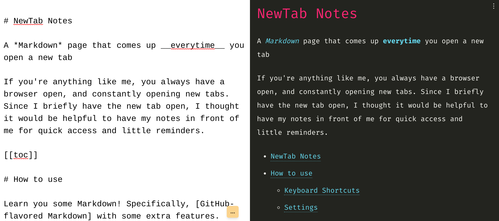

# NewTab Notes Chrome Extension

A *Markdown* page that comes up __everytime__ you open a new tab

If you're anything like me, you always have a browser open, and constantly opening new tabs. Since I briefly have the new tab open, I thought it would be helpful to have my notes in front of me for quick access and little reminders.

[Published on the Chrome Web Store](https://chrome.google.com/webstore/detail/newtab-notes/kfbhbipgippofpifimbcnbafehjndccn)

## How to use

Learn you some Markdown! Specifically, [GitHub-flavored Markdown] with some extra features. Continue reading to discover those features!

[GitHub-flavored Markdown]: https://github.github.com/gfm/

## Keyboard Shortcuts

I like to stay at the keyboard when possible without moving to the mouse. This helps my wrists from repeated stress throughout the day. Here are some keyboard shortcuts to help your wrists out!

- `ctrl-/` will toggle the editor
- `ctrl-shift-/` will toggle the settings (and editor if not open)
- `Esc` will close any window that is open, such as the editor, settings, or a color picker.

## Settings

There are several settings that you can take advantage of to customize your experience. The settings are saved as a JSON object into your Chrome storage. This means that if you have multiple computers with Chrome signed into your account, your settings and notes will persist between computers! :tada:

The settings can be adjusted.

- `emoji": true | false` Enable/disable emojis to be written as `:)` to render :) as a shortcut

- `"highlight": true | false`. Enable/disable syntax highlighting in code blocks. This uses [highlight.js].

- `"highlightTheme": "sometheme"`. Use the specified [highlight.js] theme. For a list of possible themes, see [highlight.js themes] and use the [filename] as the value, such as `"monokai-sublime"`. This only applies to code blocks, and not inline code. For inline code, please use a custom color or one of the built-in color presets.

- `"linkify": true | false`. Enable/disable auto-linking. For example, https://github.com will autolink without requiring it to be written as `[https://github.com](https://github.com)`

- `"toc": true | false`. Enable/disable generating a table of contents with the markup `[[toc]]`. See [markdown-it toc] for more info. This will create a ToC based on the H1-H2 headers.

- `"tasklists": true | false`. Enable/disable rendering tasks lists with checkboxes. `- [ ]` and `- [x]`. Note this will render as disabled checkboxes, so they're not interactive.

- `"preset": "commonmark" | "zero" | "default"`. For more information on these presets, see the [markdown-it] docs. Omitted will use `"default"`. _NOTE:_ if you set to anything other than `"default"`, other options like `linkify` may be ignored.

- `"font": "My Custom Font"`. Use this font as the general font when rendering your markdown. If you have multiple machines with different fonts, you can also specify fallbacks, eg: `"font"; "Comic Sans MS, sans"`. Defaults to your machine's sans font.

- `"codeFont": "My Custom Font"`. Use this font when rendering code blocks and inline code. If you have multiple machines with different fonts, you can also specify fallbacks, eg: `"font"; "Fira Code, mono"`. Defaults to your machine's mono font.

[highlight.js]: https://highlightjs.org/
[highlight.js themes]: https://highlightjs.org/static/demo/
[filename]: https://github.com/highlightjs/highlight.js/tree/9.18.1/src/styles
[markdown-it]: https://github.com/markdown-it/markdown-it
[markdown-it toc]: https://github.com/Oktavilla/markdown-it-table-of-contents

## Screenshot

## Credits

This is a complete rewrite of the [upstream
fork](https://github.com/intrvertmichael/MarkdownTab) which served as my initial
inspiration. Thanks to the author for publishing their extension! For my own
enjoyment, I decided to re-write it to practice some Vue and TailwindCSS from
scratch.
